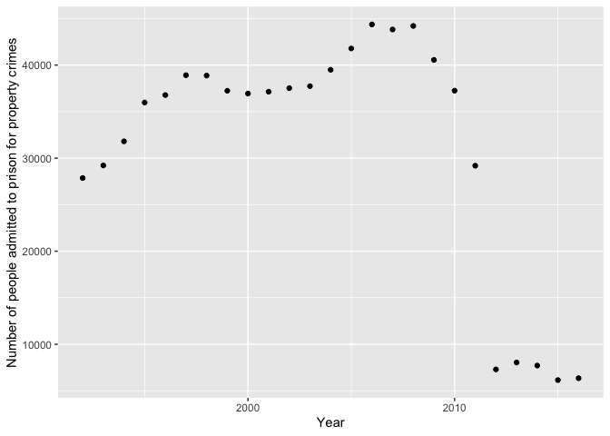
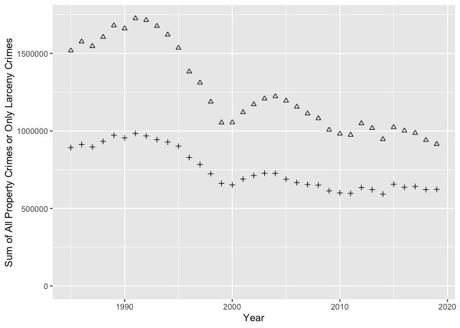
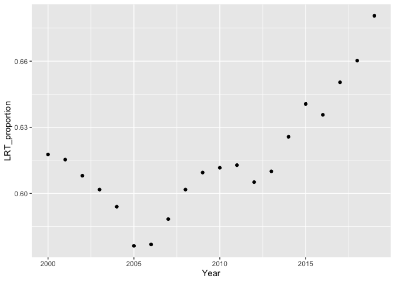
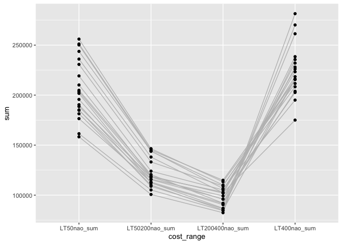
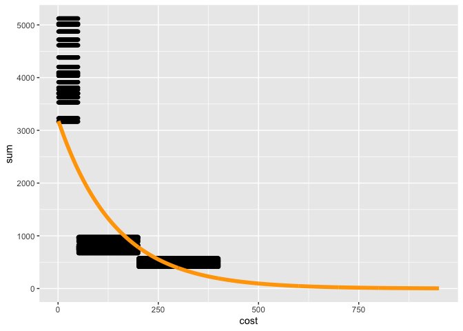

Societal Impact and Cost of CA Prop 20
================
Lida Anita To, Sivan Yair, and Fernanda Guizar

University of California — Davis

Deptartment of Evolution & Ecology

-----

### **Interactive widget:**

**<https://anitato.shinyapps.io/Societal_Impact_CAProp20/>**

# California Proposition 20, Criminal Sentencing, Parole, and DNA Collection Initiative (2020)

This Git Repository contains the directions to produce a widget that
calculates the societal cost of increasing the California prison inmate
population size under the proposed Proposition 20.

California Proposition 20, the Criminal Sentencing, Parole, and DNA
Collection Initiative, is on the ballot in California as an initiated
state statute on November 3, 2020.

The proposed bill would:

1.  Add crimes to the list of violent felonies for which parole is
    restricted

2.  Allow certain types of theft and fraud crimes currently only
    chargeable as misdemeanors to be chargeable as felonies

3.  Require DNA collection for certain misdemeanors

**Supporters** believe Prop 20 would make California safer.

**Opponents** believe the bill adds stress to an already overcrowded
prison system and that maintaining prisoners for longer sentences would
be extremely costly.

## Questions

**What is the societal cost of increasing the number of prison inmates
as a result of Proposition 20?**

  - What is the cost of increasing the number of new “wobblers” in the
    prison system to taxpayers?

  - Does society save money if Prop 20 causes a reduction in crime rate
    in California? (Under the assumption that Prop 20 could potentially
    decrease the overall crime rate.)

### More Information on Prop 20:

Summary:

<https://ballotpedia.org/California_Proposition_20,_Criminal_Sentencing,_Parole,_and_DNA_Collection_Initiative_(2020)#Assembly_Bill_109_.282011.29>

Full statute text:

<https://vig.cdn.sos.ca.gov/2020/general/pdf/topl-prop20.pdf>

## The Data

**National Archive of Criminal Justice Data:**

United States Department of Justice. Office of Justice Programs. Bureau
of Justice Statistics. National Corrections Reporting Program,
1991-2016: Selected Variables. Inter-university Consortium for Political
and Social Research \[distributor\], 2018-08-30.
<https://doi.org/10.3886/ICPSR37021.v1>

  - This dataset includes every prison entry in the United States from
    1991-2016 and their unique-individual IDs, demographic data, and
    sentencing data. We filtered this dataset for California entries
    listed under “Property Crimes” (which include: larceny, burglary,
    fraud, and motor vehicle theft).
  - *Directions:*
    1.  Make a free account with NACJD
    2.  Download the 1991-2016 data in `R` format
    3.  Place the data in the `Societal_Impact_CAProp20/data/` directory
    4.  Process, clean, and filter the data using
        `Societal_Impact_CAProp20/code/propertycrimes.R`

**California Department of Justice:**

<https://openjustice.doj.ca.gov/data>

  - This dataset contains the total number of property crimes committed
    in California (including those in which perpetrators were not
    caught) every year since 1980. It includes information on the number
    of property crimes committed that were valued $50 or less, $50-200,
    $200-400, and $400+.

  - *Directions:*
    
      - Simply download the data corresponding to section “Crimes and
        Clearances (including Arson)”

**Average cost of incarcerating a single CA prison inmate per year:**

<https://lao.ca.gov/PolicyAreas/CJ/6_cj_inmatecost>

## Method in Words

In California’s current criminal justice system, people who commit
property crimes that are less than $950 in value (called “petty theft”)
can only be charged with misdemeanors, as opposed to felonies. The
maximum sentence for these petty theft misdemeanors is jail for one
year. One of the changes that Proposition 20 would introduce is that
people who commit petty theft crimes could be sentenced to up to a year
in jail with misdemeanors (like current conditions) OR be sentenced to
16 months, 2 years, or 3 years in prison with felonies. Crimes that
could be charged as either misdemeanors or felonies are called wobbler
crimes. Those who support the change from only misdemeanor to wobbler
believe that it will make California safer, while opponents of this
change believe that sending people to prison produces a high cost to
taxpayers.

What is the cost to taxpayers for increasing the number of prison
inmates as a result of Proposition 20? Does society save money if Prop
20 causes a reduction in crime rate in California, specifically because
some property no longer gets stolen?

Our interactive figure lets you find out the conditions in which society
could save money with Prop 20’s affect on petty theft classification.
Below is a general description of how we obtained the values used to
make this interactive graph.

**Percent Reduction in Rates of Property Crimes Costing less than
$950:** We focus on crimes committed that have a value of $950 or less,
because Prop 20 introduces changes for that range of crimes. We used
crime records from the California Department of Justice to find out how
many property crimes below $950 are committed and the average cost of
those crimes. By multiplying these two values, we get the total cost of
petty theft to society in California. We calculate the fraction that
society gets back based on the user’s choice for the percent reduction
in property crimes that this proposition could lead to.

**Number of New Prison Inmates per Year under Prop 20:** This slider
lets you choose from a plausible range of values for the number of
additional people per year that will be going to prison. We were able to
estimate this range because the change that Prop 20 proposes is actually
a reversal of what Proposition 27 introduced when it was passed in 2014.
Specifically, Prop 47 made it so that petty thefts could no longer
become felonies. By looking at FBI prison records, we found a
significant decrease in the rate of new property-related felonies after
2014, when Prop 47 passed. We assume that this reduction represents the
number of people who would have been sentenced to prison with felonies
if that were possible, but instead went to county jail for one year with
a misdemeanor instead. The range of values provided are the 95%
confidence interval of the difference in means between 2012-2014
(felonies allowed) and 2015-2016 (felonies not allowed). We note that
this count is a conservative estimate because it excludes the convicted
felons that went to county jail for their sentence. In 2011, California
bill AB109 allowed the possibility for felons to serve their sentence in
jails instead of prisons. We could not find jail records that allowed us
to track the number of felons of property crimes in jail over time.

**Average Sentence Length:** The minimum and maximum are based on the
range of sentence lengths for felons of property crimes: 16 months and 3
years, respectively. Since we are interested in the additional cost of
Prop 20 relative to current conditions, we subtract the average sentence
length by 1 because we assume that those who would be entering the
prison system would have been sentenced to jail for the maximum time
without Prop 20.

-----

# R Shiny

Code for the R Shiny interactive widget can be found in
`Societal_Impact_CAProp20/code/CAProp20_rshiny.R`

**You can interact with the live widget
[here](https://anitato.shinyapps.io/Societal_Impact_CAProp20/).**

This widget allows you to calculate the net annual cost of the increase
in prison population as a result of Proposition 20. There are sliders
for

-----

## Method Predictions w/ Figures

### Overview

For these predictions, we first obtain a plausible range of for the
number of crimes that would be misdemeanors in the present but would
become felonies with Prop 20. We then infer the crime rate below $950
and the average cost of crimes below $950.

### New Prison Inmates

In this section, we identify a 95% confidence interval for the change in
the number of felons introduced to prison populations when petty theft
criminals are allowed to go to prison. We do this by comparing the
number of felons in prison for property crimes from 2011-2014 and
2015-2016. The former range corresponds to the years in which prison
sentences were permitted, whereas in the latter range they were not
permitted. We do not use data before 2011 because AB109 caused a large
decrease in prison populations for reasons outside of the purview of our
research questions. We do not have data from after 2016.

Let’s start by looking at the trend of property felonies over time.

``` r
# loads table called propertycrimes, produced by scrip t property_felons_in_prison.R
# we cannot share this because you need to create an account to view the data (see README.md)
# so we just read it in locally
load("/Users/anita/Documents/GitHub/Societal_Impact_Prop20/data/propertycrimes.rda") 

felons = data.frame(propertycrimes) 
colnames(felons)=c("Year","felons_sum")
felons$Year=as.integer(as.character(felons$Year))
# filter just to 1992 and after because data before that is incomplete
felons = felons %>% filter(Year>=1992)

ggplot(felons,aes(x=Year,y=felons_sum)) + geom_point() + labs(x="Year",y="Number of people admitted to prison for property crimes")
```

<!-- -->

Now we can test for a significant difference in mean number of felons
admitted between 2011-2014 and 2015-2016

``` r
# new column: prop20 is now a T/F variable. Years 2011-2014 represent prop 20 conditions 
felons = felons %>% filter(Year>2011) %>% mutate(prop20=Year<=2014) 

# paired t test shows there's a significant difference
t.test(felons$felons_sum~felons$prop20,conf.level=0.95)
```

    ## 
    ##  Welch Two Sample t-test
    ## 
    ## data:  felons$felons_sum by felons$prop20
    ## t = -6.0381, df = 2.7046, p-value = 0.01218
    ## alternative hypothesis: true difference in means is not equal to 0
    ## 95 percent confidence interval:
    ##  -2237.1592  -628.8408
    ## sample estimates:
    ## mean in group FALSE  mean in group TRUE 
    ##                6254                7687

We will save the 95 percent confidence interval representing the
plausible range of the number of misdemeanors that would become felonies
with Prop 20. We need to reverse the output of the confidence interval
(make it positive instead of negative) because the output represents
change from having Prop 20 conditions to not having Prop 20 conditions,
whereas we want to know about change in the opposite direction.

``` r
output_ttest=t.test(felons$felons_sum~felons$prop20,conf.level=0.95)
# reverse output of confidence interval
conf_int_wobblers_entering_prison = c(-output_ttest$conf.int[2],
                      -output_ttest$conf.int[1])
saveRDS(conf_int_wobblers_entering_prison,"/Users/anita/Documents/GitHub/Societal_Impact_Prop20/data/wobbler_range.RDS")
```

## Property Crime Rates and Average Cost Below $950

We start by loading in the crime data and taking a quick look.

``` r
crimes=read.csv("/Users/anita/Documents/GitHub/Societal_Impact_Prop20/data/Crimes_and_Clearances_with_Arson-1985-2019.csv")
head(crimes)
```

    ##   Year         County                         NCICCode Violent_sum Homicide_sum
    ## 1 1985 Alameda County Alameda Co. Sheriff's Department         427            3
    ## 2 1985 Alameda County                          Alameda         405            7
    ## 3 1985 Alameda County                           Albany         101            1
    ## 4 1985 Alameda County                         Berkeley        1164           11
    ## 5 1985 Alameda County                       Emeryville         146            0
    ## 6 1985 Alameda County                          Fremont         614            3
    ##   ForRape_sum Robbery_sum AggAssault_sum Property_sum Burglary_sum
    ## 1          27         166            231         3964         1483
    ## 2          15         220            163         4486          989
    ## 3           4          58             38          634          161
    ## 4          43         660            450        12035         2930
    ## 5           5          82             59          971          205
    ## 6          34          86            491         6053         1786
    ##   VehicleTheft_sum LTtotal_sum ViolentClr_sum HomicideClr_sum ForRapeClr_sum
    ## 1              353        2128            122               4              6
    ## 2              260        3237            205               7              8
    ## 3               55         418             58               1              3
    ## 4              869        8236            559               4             32
    ## 5              102         664             19               0              0
    ## 6              350        3917            390               2             16
    ##   RobberyClr_sum AggAssaultClr_sum PropertyClr_sum BurglaryClr_sum
    ## 1             32                80             409             124
    ## 2             67               123             889              88
    ## 3             23                31             166              62
    ## 4            198               325            1954             397
    ## 5              4                15              36               9
    ## 6             27               345            1403             424
    ##   VehicleTheftClr_sum LTtotalClr_sum TotalStructural_sum TotalMobile_sum
    ## 1                   7            278                  22               6
    ## 2                  62            739                  23               4
    ## 3                  16             88                   2               0
    ## 4                 177           1380                  72              23
    ## 5                   8             19                   0               1
    ## 6                  91            888                  37              26
    ##   TotalOther_sum GrandTotal_sum GrandTotClr_sum RAPact_sum ARAPact_sum
    ## 1              3             31              11         22           5
    ## 2              5             32               7          9           6
    ## 3              0              2               1          2           2
    ## 4              5            100              20         31          12
    ## 5              0              1               0          4           1
    ## 6             61            124              14         21          13
    ##   FROBact_sum KROBact_sum OROBact_sum SROBact_sum HROBnao_sum CHROBnao_sum
    ## 1          77          22           3          64          59           38
    ## 2          56          23          11         130         136           48
    ## 3          23           2           2          31          26           15
    ## 4         242          71          43         304         351          150
    ## 5          35          10          11          26          56            9
    ## 6          38           7           3          38          32           21
    ##   GROBnao_sum CROBnao_sum RROBnao_sum BROBnao_sum MROBnao_sum FASSact_sum
    ## 1          23          32          11           3           0          25
    ## 2           2           2          20           2          10          16
    ## 3           1           2           6           3           5           3
    ## 4           0           0          47          21          91          47
    ## 5           2           0          14           0           1           6
    ## 6           7           8           9           2           7          47
    ##   KASSact_sum OASSact_sum HASSact_sum FEBURact_Sum UBURact_sum RESDBUR_sum
    ## 1          27         111          68         1177         306        1129
    ## 2          30          90          27          747         242         637
    ## 3           2          10          23           85          76         100
    ## 4         103         224          76         2040         890        2015
    ## 5           8           9          36          161          44          89
    ## 6          38         120         286         1080         706        1147
    ##   RNBURnao_sum RDBURnao_sum RUBURnao_sum NRESBUR_sum NNBURnao_sum NDBURnao_sum
    ## 1          206          599          324         354          216           47
    ## 2          175          195          267         352          119           46
    ## 3           33           44           23          61           32           21
    ## 4          597         1418            0         915          224          691
    ## 5           32           26           31         116           44           14
    ## 6          292          485          370         639          274          110
    ##   NUBURnao_sum MVTact_sum TMVTact_sum OMVTact_sum PPLARnao_sum PSLARnao_sum
    ## 1           91        233          56          64            5           60
    ## 2          187        187          33          40           31           20
    ## 3            8         42           4           9           26            4
    ## 4            0        559          55         255          133          163
    ## 5           58         85           9           8            5            4
    ## 6          255        219          71          60           10           14
    ##   SLLARnao_sum MVLARnao_sum MVPLARnao_sum BILARnao_sum FBLARnao_sum
    ## 1          289          930           109          205           44
    ## 2          664          538           673          516          183
    ## 3           40          147            62           39           46
    ## 4         1277         3153           508          611         1877
    ## 5            1          207           153           16           85
    ## 6          704         1136           446          360          493
    ##   COMLARnao_sum AOLARnao_sum LT400nao_sum LT200400nao_sum LT50200nao_sum
    ## 1            11          475          753             437            440
    ## 2            53          559          540             622            916
    ## 3            17           37           84              68            128
    ## 4            18          496          533             636           2793
    ## 5            24          169          217             122            161
    ## 6            27          727          937             607           1012
    ##   LT50nao_sum
    ## 1         498
    ## 2        1159
    ## 3         138
    ## 4        4274
    ## 5         164
    ## 6        1361

Our git repository contains the pdf describing what all of the column
names mean. The ones we are interested in, and their definition, are
listed below: - Property\_sum: number of property crimes (sum of
burglary, motor vehicle, and larceny) - LTtotal\_sum: number of
larceny-thefts - PropertyClr\_sum: number of property crimes cleared aka
charged - SLLARnao\_sum: number of shoplifting crimes - LT400nao\_sum:
number of larceny thefts over $400 - LT200400nao\_sum: number of larceny
thefts from $200-400 - LT50200nao\_sum: number of larceny thefts from
$50-199 - LT50nao\_sum: number of larceny thefts under $50

We remove county-level information by taking the sum of all counts in a
category for a given year.

``` r
crimes_sumYear=crimes %>%
  select(-County,-NCICCode) %>% group_by(Year) %>% summarise_each(funs(sum))
```

Here are the counts of property crimes per year and number of larceny
thefts per year (larceny thefts make up a subset of the total property
crimes):

``` r
crimes_sumYear %>%
  ggplot(aes(x=Year))+
  geom_point(aes(y=Property_sum),pch=2)+
  geom_point(aes(y=LTtotal_sum),pch=3) +
  ylim(0,max(crimes_sumYear$Property_sum)) +
  labs(y="Sum of All Property Crimes or Only Larceny Crimes")
```

<!-- -->

The decline in crime in the 1990s is a phenomenon observed across the
United States, and there is no consensus on the cause. We therefore
remove all data points before 2000.

``` r
crimes_sumYear = crimes_sumYear %>% filter(Year>=2000)
```

We need to know the average cost of crimes under $950. We only have data
on these values for larceny thefts, but they do make up around 55-70% of
property crimes, and seem to be on the rise in recent years. Let’s see
what the trends are:

``` r
# proportion of property crimes attributable to larceny
crimes_sumYear %>% mutate(LRT_proportion=LTtotal_sum/Property_sum) %>%
  ggplot(aes(x=Year,y=LRT_proportion))+
  geom_point()
```

<!-- -->

``` r
# average of the above proportion across years
avg_LRT_proportion=crimes_sumYear %>% mutate(LRT_proportion=LTtotal_sum/Property_sum) %>% summarise(avg_LRT_proportion=mean(LRT_proportion))
avg_LRT_proportion
```

    ## # A tibble: 1 x 1
    ##   avg_LRT_proportion
    ##                <dbl>
    ## 1              0.616

Here are the counts of each price range of larceny thefts:

``` r
crime_costs=crimes_sumYear %>% select(Year,LT400nao_sum,LT200400nao_sum,LT50200nao_sum,LT50nao_sum) %>%
  gather(cost_range,sum,LT400nao_sum,LT200400nao_sum,LT50200nao_sum,LT50nao_sum)

# order the categorical data to reflect increasing discrete intervals
crime_costs$cost_range=factor(crime_costs$cost_range, levels=c("LT50nao_sum","LT50200nao_sum","LT200400nao_sum","LT400nao_sum"))

crime_costs %>% 
  ggplot(aes(x=cost_range,y=sum,group=Year)) +
  geom_line(col="grey") +
  geom_point() 
```

<!-- -->

There seems to be a clear decay where most crimes committed are for
small values. We are interested in the average cost of crimes below
$950, and so we need to build a model that uses the data we do have to
continuously predict the number of costs we observe. Since we are
working with count data, we use the Poisson to model how the crime count
changes with the cost of the crime, among the bounded cost ranges. We
spread the count of a crime category across all integer values before
proceeding with our models, then parameterize our model, then make
predictions for the shiny app.

``` r
# make a data frame in which the cost of a category is split evenly across its range
cost_range_numeric=list("LT50nao_sum"=1:50,"LT50200nao_sum"=51:200,"LT200400nao_sum"=201:400)

crime_costs_estimation = do.call(rbind,apply(crime_costs[crime_costs$cost_range!="LT400nao_sum",],1,function(row){ # row has variables Year, cost_range, and sum
  return(data.frame(Year=row["Year"],cost=cost_range_numeric[[row["cost_range"]]],sum=as.integer(row["sum"])/length(cost_range_numeric[[row["cost_range"]]]),row.names = NULL))
  
}))
```

``` r
# Poisson model 
poisson.model = glm(sum ~ cost, crime_costs_estimation, family = poisson(link = "log"))
```

``` r
summary(poisson.model)
```

    ## 
    ## Call:
    ## glm(formula = sum ~ cost, family = poisson(link = "log"), data = crime_costs_estimation)
    ## 
    ## Deviance Residuals: 
    ##     Min       1Q   Median       3Q      Max  
    ## -38.909  -10.911   -0.939   11.030   51.729  
    ## 
    ## Coefficients:
    ##               Estimate Std. Error z value Pr(>|z|)    
    ## (Intercept)  8.071e+00  5.379e-04   15003   <2e-16 ***
    ## cost        -7.022e-03  3.539e-06   -1984   <2e-16 ***
    ## ---
    ## Signif. codes:  0 '***' 0.001 '**' 0.01 '*' 0.05 '.' 0.1 ' ' 1
    ## 
    ## (Dispersion parameter for poisson family taken to be 1)
    ## 
    ##     Null deviance: 6949092  on 7999  degrees of freedom
    ## Residual deviance: 2254567  on 7998  degrees of freedom
    ## AIC: Inf
    ## 
    ## Number of Fisher Scoring iterations: 4

``` r
# Show how the Poisson model fits to the data
pred_pois= data.frame(cost=1:950,sum=predict(poisson.model, newdata = data.frame(cost=1:950), type = "response"))

ggplot() +
  geom_point(data=crime_costs_estimation, aes(x=cost,y=sum,group=Year)) +
  geom_line(data=pred_pois, aes(x=cost,y=sum),col="orange",lwd=2) +
  ylim(0,max(crime_costs_estimation$sum))
```

<!-- -->

``` r
# poisson model parameters
a=unname(coef(poisson.model)[1]) # intercept for log(y)
b=unname(coef(poisson.model)[2]) # slope for log(y)

# VALUES FOR SHINY
# range that we care about
high=950
low=1

# functions
y_count=function(x) exp(a+(b-x)) # number of crimes of value x
y_cost=function(x) x-exp(a+(b-x)) # total cost of all crimes of value x: cost of crime of value x - number of crimes of value x

# expected number of crimes in price range provided
total_crime=integrate(f=y_count,lower=low,upper=high)$value
total_crime
```

    ## [1] 1168.613

``` r
# expected total cost of all of these crimes (this accounts for number of crimes of each type)
total_cost=integrate(f=y_cost,lower=low,upper=high)$value
total_cost
```

    ## [1] 450080.9

``` r
# average cost of each crime
avg_cost=total_cost/total_crime
avg_cost
```

    ## [1] 385.141

``` r
saveRDS(total_crime/as.numeric(avg_LRT_proportion),"../data/total_crime.RDS") # we inflate the total crime rate because not all thefts are larceny
saveRDS(total_cost,"../data/total_cost.RDS")
saveRDS(avg_cost,"../data/avg_cost.RDS")
```

## Caveats

We use a simple Poisson model to predict the number of crimes committed
per value of that crime. To parameterize this model we use the number of
larceny thefts in discrete cost ranges with different size intervals up
until $400. Since around 60% of all property crimes are larceny thefts,
we inflate the total number of crimes under $950 predicted by our model
by \~0.6 to estimate the contemporary average number of property crimes
valued at less than $950 per year.

As described above, Assembly Bill 109 drastically reduced the size of
prison populations for those prisoners who were sentenced for
involvement in property crime. In addition, we do not have prison data
beyond 2016. Therefore we only have a few data points to estimate the
mean difference in admitted felons pre- and post- Proposition 47 in
2014. We also likely underestimate the number of crimes that would be
considered misdemeanors in the current system but felonies with Prop 20
because we did not have jail records that would allow us to investigate
trends in the jail population that was sentenced for property crimes. We
believe that there are felony sentences that would be carried out in
jails that we do not include as a cost to society in our models.

The total cost of inmates in a year is actually the total cost that
taxpayers commit to paying over the next few years, but don’t
necessarily pay in full the first year that a person is admitted to
prison. True yearly costs are more difficult to predict because we would
need to account for the growing prison population in the long term, as
well as variation among prison sentences rather than the mean, if
sentences last for greater than 1 year.
=======
Societal Impact and Cost of CA Prop 20
================
Lida Anita To, Sivan Yair, and Fernanda Guizar

University of California — Davis

Deptartment of Evolution & Ecology

-----

### **Interactive widget:**

**<https://anitato.shinyapps.io/Societal_Impact_CAProp20/>**

# California Proposition 20, Criminal Sentencing, Parole, and DNA Collection Initiative (2020)

This Git Repository contains the directions to produce a widget that
calculates the societal cost of increasing the California prison inmate
population size under the proposed Proposition 20.

California Proposition 20, the Criminal Sentencing, Parole, and DNA
Collection Initiative, is on the ballot in California as an initiated
state statute on November 3, 2020.

The proposed bill would:

1.  Add crimes to the list of violent felonies for which parole is
    restricted

2.  Allow certain types of theft and fraud crimes currently only
    chargeable as misdemeanors to be chargeable as felonies

3.  Require DNA collection for certain misdemeanors

**Supporters** believe Prop 20 would make California safer.

**Opponents** believe the bill adds stress to an already overcrowded
prison system and that maintaining prisoners for longer sentences would
be extremely costly.

## Questions

**What is the societal cost of increasing the number of prison inmates
as a result of Proposition 20?**

  - What is the cost of increasing the number of new “wobblers” in the
    prison system to taxpayers?

  - Does society save money if Prop 20 causes a reduction in crime rate
    in California? (Under the assumption that Prop 20 could potentially
    decrease the overall crime rate.)

### More Information on Prop 20:

Summary:

<https://ballotpedia.org/California_Proposition_20,_Criminal_Sentencing,_Parole,_and_DNA_Collection_Initiative_(2020)#Assembly_Bill_109_.282011.29>

Full statute text:

<https://vig.cdn.sos.ca.gov/2020/general/pdf/topl-prop20.pdf>

## The Data

**National Archive of Criminal Justice Data:**

United States Department of Justice. Office of Justice Programs. Bureau
of Justice Statistics. National Corrections Reporting Program,
1991-2016: Selected Variables. Inter-university Consortium for Political
and Social Research \[distributor\], 2018-08-30.
<https://doi.org/10.3886/ICPSR37021.v1>

  - This dataset includes every prison entry in the United States from
    1991-2016 and their unique-individual IDs, demographic data, and
    sentencing data. We filtered this dataset for California entries
    listed under “Property Crimes” (which include: larceny, burglary,
    fraud, and motor vehicle theft).
  - *Directions:*
    1.  Make a free account with NACJD
    2.  Download the 1991-2016 data in `R` format
    3.  Place the data in the `Societal_Impact_CAProp20/data/` directory
    4.  Process, clean, and filter the data using
        `Societal_Impact_CAProp20/code/propertycrimes.R`

**California Department of Justice:**

<https://openjustice.doj.ca.gov/data>

  - This dataset contains the total number of property crimes, and some   
    subcategories, reported in California every year since 1980. It includes information on the number
    of larceny thefts that were valued $50 or less, $50-200,
    $200-400, and $400+.
  - *Directions:* Simply download the data corresponding to section "Crimes and Clearances (including Arson)"

**Average cost of maintaining a single CA prison inmate per year**

<https://lao.ca.gov/PolicyAreas/CJ/6_cj_inmatecost>

## Method

In California’s current criminal justice system, people who commit
property crimes that are less than $950 in value (called “petty theft”)
can only be charged with misdemeanors, as opposed to felonies. The
maximum sentence for these petty theft misdemeanors is jail for one
year. One of the changes that Proposition 20 would introduce is that
people who commit petty theft crimes could be sentenced to up to a year
in jail with misdemeanors (like current conditions) OR be sentenced to
16 months, 2 years, or 3 years in prison with felonies. Crimes that
could be charged as either misdemeanors or felonies are called wobbler
crimes. Those who support the change from only misdemeanor to wobbler
believe that it will make California safer, while opponents of this
change believe that sending people to prison produces a high cost to
taxpayers.

*What is the cost to taxpayers for increasing the number of prison
inmates as a result of Proposition 20? Does society save money if Prop
20 causes a reduction in crime rate in California, specifically because
some property no longer gets stolen?*

Our interactive figure lets you find out the conditions in which society
could save money with Prop 20’s affect on petty theft classification.
Below is a general description of how we obtained the values used to
make this interactive graph.

**Percent Reduction in Rates of Property Crimes Costing less than
$950:** We focus on crimes committed that have a value of $950 or less,
because Prop 20 introduces changes for that range of crimes. We used
crime records from the California Department of Justice to find out how
many property crimes below $950 are committed and the average cost of
those crimes. By multiplying these two values, we get the total cost of
petty theft to society in California. We calculate the fraction that
society gets back based on the user’s choice for the percent reduction
in property crimes that this proposition could lead to.

**Number of New Prison Inmates per Year under Prop 20:** This slider
lets you choose from a plausible range of values for the number of
additional people per year that will be going to prison. We were able to
estimate this range because the change that Prop 20 proposes is actually
a reversal of what Proposition 27 introduced when it was passed in 2014.
Specifically, Prop 47 made it so that petty thefts could no longer
become felonies. By looking at FBI prison records, we found a
significant decrease in the rate of new property-related felonies after
2014, when Prop 47 passed. We assume that this reduction represents the
number of people who would have been sentenced to prison with felonies
if that were possible, but instead went to county jail for one year with
a misdemeanor instead. The range of values provided are the 95%
confidence interval of the difference in means between 2012-2014
(felonies allowed) and 2015-2016 (felonies not allowed). We note that
this count is a conservative estimate because it excludes the convicted
felons that went to county jail for their sentence. In 2011, California
bill AB109 allowed the possibility for felons to serve their sentence in
jails instead of prisons. We could not find jail records that allowed us
to track the number of felons of property crimes in jail over time.

**Average Sentence Length:** The minimum and maximum are based on the
range of sentence lengths for felons of property crimes: 16 months and 3
years, respectively. Since we are interested in the additional cost of
Prop 20 relative to current conditions, we subtract the average sentence
length by 1 because we assume that those who would be entering the
prison system would have been sentenced to jail for the maximum time
without Prop 20. The cost per year can be found at:
<https://lao.ca.gov/PolicyAreas/CJ/6_cj_inmatecost>

## R Shiny

Code for the R Shiny interactive widget can be found in
`Societal_Impact_CAProp20/code/CAProp20_rshiny.R`

**You can interact with the live widget
[here](https://anitato.shinyapps.io/Societal_Impact_CAProp20/).**

This widget allows you to calculate the net annual cost of the increase
in prison population as a result of Proposition 20. There are sliders
for each bolded section above.

## Caveats
We use a simple Poisson model to predict the number of crimes committed per value of that crime. To parameterize this model we use the number of larceny thefts in discrete cost ranges with different size intervals up until $400. Since around 60% of all property crimes are larceny thefts, we inflate the total number of crimes under $950 predicted by our model by ~1/0.6 to estimate the contemporary average number of property crimes valued at less than $950 per year.

As described above, Assembly Bill 109 drastically reduced the size of prison populations for those prisoners who were sentenced for involvement in property crime. In addition, we do not have prison data beyond 2016. Therefore we only have a few data points to estimate the mean difference in admitted felons pre- and post- Proposition 47 in 2014. We also likely underestimate the number of crimes that would be considered misdemeanors in the current system but felonies with Prop 20 because we did not have jail records that would allow us to investigate trends in the jail population that was sentenced for property crimes. We believe that there are felony sentences that would be carried out in jails that we do not include as a cost to society in our models.

The total cost of inmates in a year is actually the total cost that taxpayers commit to paying over the next few years, but don't necessarily pay in full the first year that a person is admitted to prison. True yearly costs are more difficult to predict because we would need to account for the growing prison population in the long term, as well as variation among prison sentences rather than the mean, if sentences last for greater than 1 year.
